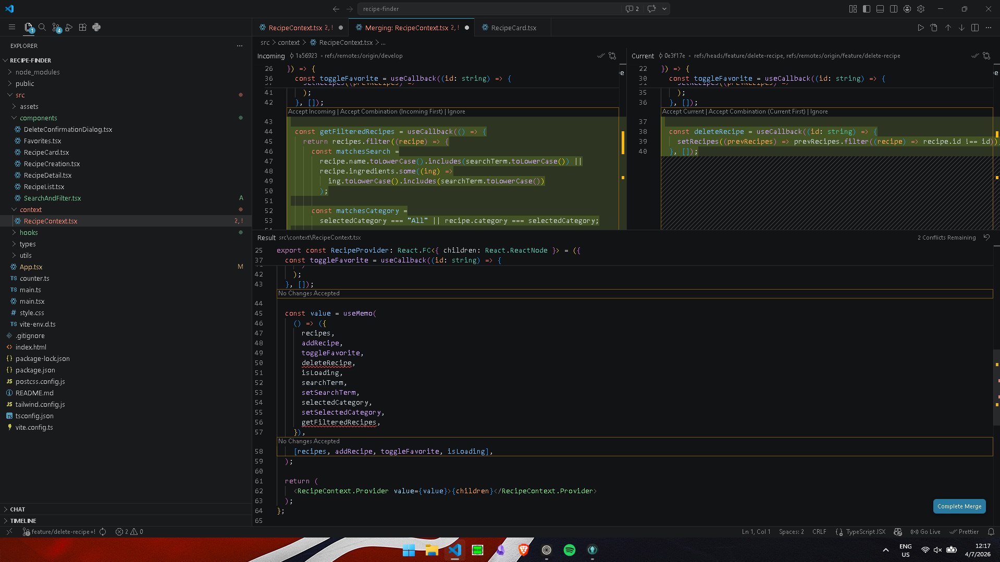
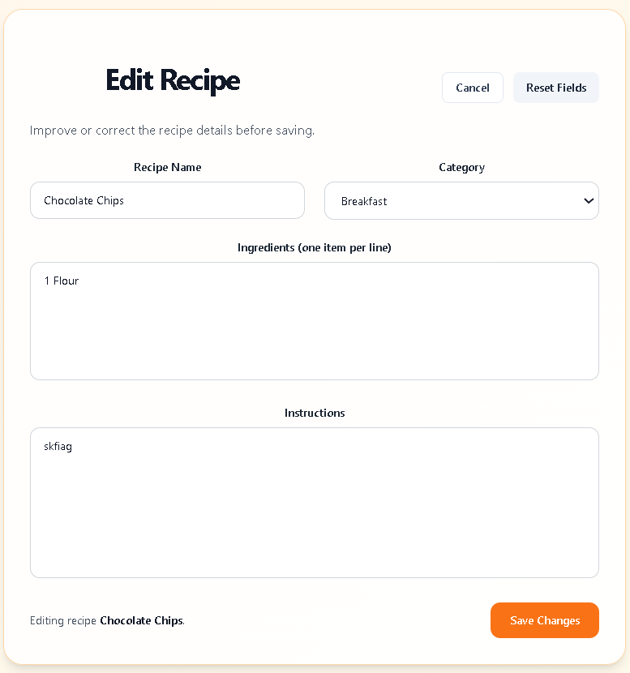
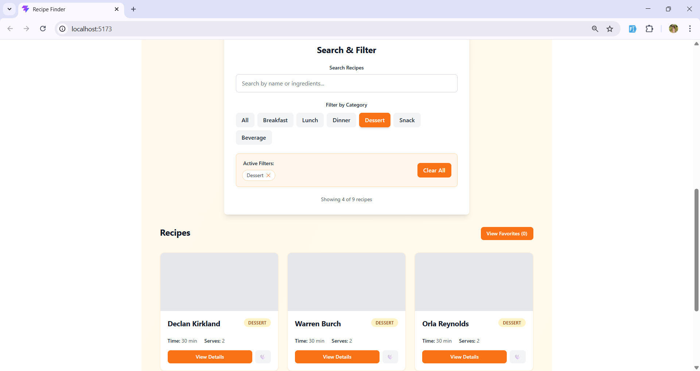
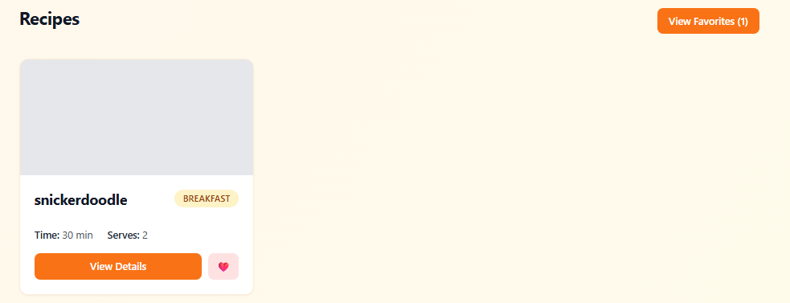
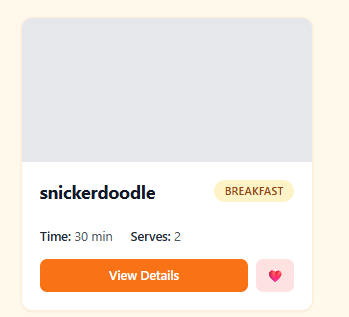

# Recipe Finder

A recipe collection application that helps users discover, organize, and save their favorite recipes with easy search and filtering capabilities.

---

## Team Members

| Full Name                  | Role      | GitHub Username | Assigned Atomic Task         |
| -------------------------- | --------- | --------------- | ---------------------------- |
| Arañez, John Patrick       | Developer | @PotatoCode09   | Recipe Details and Favorites |
| Castro, Azriel Kaye        | Developer | @AzrielKaye     | Search and Filter            |
| Catoy, Daniel Niño         | Developer | @Yeyel29        | Recipe Creation              |
| Dumilon, John Earl Patrick | Developer | @Htaruo         | Delete Recipes               |
| Flores, Raniel John        | Developer | @Rani-Cmd       | Edit Recipes                 |
| Pongos, Jessie Louise      | Developer | @Owepiee04      | Recipe Display               |

---

## Features Implemented

- [x] Add Recipe - Create recipes with ingredients and instructions
- [x] Recipe Cards - Display recipes in card layout
- [x] View Recipe Details - Show full recipe information
- [x] Search/Filter - Filter by category (Breakfast, Lunch, Dinner, etc.)
- [x] Favorite Recipes - Mark and view favorite recipes
- [x] Edit Recipe - Modify recipe details
- [x] Delete Recipe - Remove recipes with confirmation
- [x] Responsive Grid Layout - Auto-fill card grid for different screen widths
- [x] Empty and Loading States - "No recipes yet" message and skeleton cards

---

## Technology Stack

- **Frontend Framework:** React
- **Language:** TypeScript
- **Build Tool:** Vite
- **Styling:** Tailwind CSS + CSS
- **State Management:** React Context + React Hooks
- **Version Control:** Git & GitHub

---

## Setup & Installation

### Prerequisites

- Node.js (v18 or higher)
- npm or yarn
- Git

### Installation Steps

1. **Clone the repository**
   ```bash
   git clone https://github.com/csci151-recipeworld-org/recipe-finder.git
   cd recipe-finder
   ```

````

2. **Install dependencies**
   ```bash
   npm install
````

3. **Run the development server**

   ```bash
   npm start
   ```

4. **Open your browser**

   http://localhost:5173

---

## Git Workflow & Branching Strategy

### Branches Used

- **`main`** - Production-ready code
- **`develop`** - Integration branch for features
- **`feature/add-recipe`** - Recipe creation form and validation
- **`feature/recipe-search`** - Search and filter functionality
- **`feature/favorites`** - Favorites view and favorite toggle workflow
- **`feature/recipe-cards`** - Recipe cards, list, and responsive layout
- **`feature/edit`** - Edit recipe features
- **`feature/delete`** - Delete recipe features
- **`hotfix/app-fix`** - Refactored redundant components

### Commit Convention

We followed the **Conventional Commits** specification:

- `feat:` - New features
- `fix:` - Bug fixes
- `docs:` - Documentation updates
- `style:` - Code formatting, UI styling
- `refactor:` - Code refactoring

### Pull Request Workflow

1. Create feature branch from `develop`
2. Implement feature with atomic commits
3. Push branch to GitHub
4. Create Pull Request to `develop`
5. Team reviews and provides feedback
6. Merge after approval
7. Delete feature branch

### Merge Conflicts Resolved



Conflict: Merge conflict in App.tsx when merging feature/recipe-cards into develop
Files Affected: App.tsx
Cause: Multiple members edited shared recipe state and view flow at the same time (card rendering, favorites, and detail navigation).
Resolution: Resolved by consolidating state management into RecipeContext, keeping a single source of truth for recipes and favorite toggling, then updating App.tsx to use one AppContent flow that conditionally renders Home, Details, and Favorites while passing consistent handlers to RecipeList and RecipeDetail.

- **Resolved By:** [John Patrick Dumilon & John Patrick Aranez]

---

## Project Structure

```
recipe-finder/
├── public/
├── src/
│   ├── components/
|   |   ├── DeleteConfirmationDialog.tsx
|   |   ├── RecipeEditor.tsx
│   │   ├── RecipeCreation.tsx
│   │   ├── RecipeCard.tsx
│   │   ├── RecipeList.tsx
│   │   ├── RecipeDetail.tsx
│   │   └── Favorites.tsx
│   │   └── SearchAndFilter.tsx
│   ├── context/
│   │   └── RecipeContext.tsx
│   ├── hooks/
│   │   └── useRecipeForm.ts
│   ├── types/
│   │   └── recipe.ts
│   ├── utils/
│   │   └── recipeValidation.ts
│   ├── App.tsx
│   ├── main.tsx
│   ├── style.css
│   └── vite-env.d.ts
├── package.json
└── README.md
```

---

## Screenshots








---

## Challenges & Learnings

**Challenges:**

- Coordinating state updates while multiple features were being integrated
- Keeping UI consistent across home, detail, and favorites views
- Managing development server port conflicts during local testing

**Key Learnings:**

- Shared state with React Context reduces prop drilling and simplifies feature integration
- Atomic commits and clear PR descriptions improve collaboration
- Consistent component patterns make UI updates easier across the app

---

## Repository Links

- **Organization:** https://github.com/csci151-recipeworld-org
- **Repository:** https://github.com/csci151-recipeworld-org/recipe-finder

---

## Contributors

**Group 4 - CSci 151 Event Driven Programming**

- Arañez, John Patrick - @PotatoCode09
- Castro, Azriel Kaye - @AzrielKaye
- Catoy, Daniel Niño - @Yeyel29
- Dumilon, John Earl Patrick - @Htaruo
- Flores, Raniel John - @Rani-CMD
- Pongos, Jessie Louise - @Owepiee04

**Course Professors:**

- Mr. Jomari Joseph A. Barrera
- Mr. Kyle Anthony F. Nierras

**Institution:** Visayas State University - Department of Computer Science and Technology

---

**Last Updated:** [Date]
